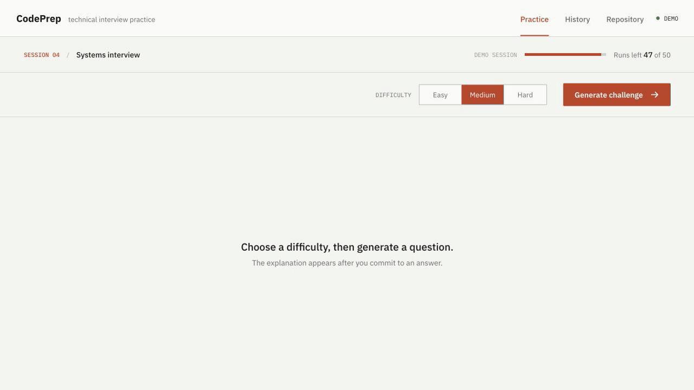
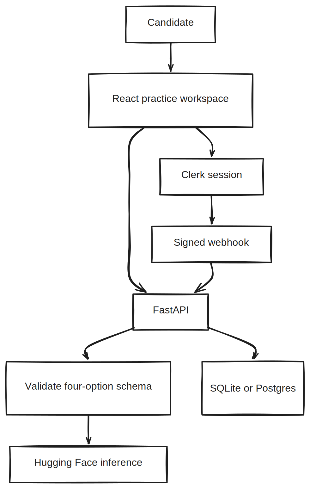

# CodePrep

[](https://github.com/ethanvillalovoz/codeprep/actions/workflows/ci.yml)
[](LICENSE)
[](https://react.dev/)
[](https://fastapi.tiangolo.com/)

Most practice tools make the explanation too easy to peek at. CodePrep puts one interview question in front of you, waits for an answer, and only then shows the reasoning. The live path adds authenticated history and a daily generation limit.

[](docs/media/codeprep-demo.mp4)

In the recording, I answer a binary-search-tree question, check the rationale, and request a harder follow-up. [MP4 demo](docs/media/codeprep-demo.mp4) · [poster frame](docs/media/codeprep-poster.webp)

## What Is Actually Here

- A deterministic demo that opens without accounts, API keys, or a running backend.
- A protected production path with Clerk authentication and server-verified sessions.
- Structured LLM output validated by Pydantic before it reaches the database.
- Atomic challenge and quota updates so provider failures never consume a credit.
- Responsive interaction states for generation, answer feedback, and history review.
- A small FastAPI surface with bounded history, restricted CORS, and generic errors.

## Run The Demo

The frontend starts in demo mode by default. Its fixtures use the same data contract as the live API.

```bash
git clone https://github.com/ethanvillalovoz/codeprep.git
cd codeprep/frontend
npm install
npm run dev
```

Open `http://localhost:5173`. No credentials are required.

## Run The Full Stack

### 1. Backend

```bash
python3 -m venv backend/.venv
source backend/.venv/bin/activate
pip install -r backend/requirements.txt
cp backend/src/.env.example backend/src/.env
cd backend
python server.py
```

Configure the Clerk and Hugging Face values in `backend/src/.env` first. The API runs at `http://localhost:8000`.

### 2. Frontend

```bash
cd frontend
cp .env.example .env
npm install
npm run dev
```

Set `VITE_CODEPREP_MODE=live` in `frontend/.env` to enable Clerk and the API client.

## Architecture

[](docs/media/architecture.excalidraw)

The image links to an editable Excalidraw file.

The browser never receives the model token. The backend asks a hosted inference provider for JSON, validates the exact four-option schema, then writes the challenge and quota decrement in one transaction.

## API Surface

| Method | Route | Purpose |
| --- | --- | --- |
| `GET` | `/health` | Deployment health check |
| `POST` | `/api/generate-challenge` | Generate and persist one validated challenge |
| `GET` | `/api/my-history` | Return the latest 100 challenges for the user |
| `GET` | `/api/quota` | Return or initialize daily quota |
| `POST` | `/webhooks/clerk` | Provision quota from a signed Clerk event |

Interactive OpenAPI documentation is available at `/docs` while the backend is running.

## Configuration

Backend variables:

```dotenv
CLERK_API_KEY=your_clerk_secret_key
JWT_KEY=your_jwt_key
CLERK_AUTHORIZED_PARTIES=http://localhost:5173
CLERK_WEBHOOK_SECRET=your_clerk_webhook_secret
HUGGINGFACE_TOKEN=your_huggingface_token
CODEPREP_MODEL_ID=meta-llama/Meta-Llama-3-8B-Instruct
DATABASE_URL=sqlite:///./challenges.db
ALLOWED_ORIGINS=http://localhost:5173
```

Frontend variables:

```dotenv
VITE_CODEPREP_MODE=live
VITE_CLERK_PUBLISHABLE_KEY=your_clerk_publishable_key
VITE_API_BASE_URL=http://localhost:8000
```

## Verification

```bash
cd frontend
npm run check

cd ../backend
pip install -r requirements-ci.txt
ruff check src tests
pytest -q
```

The frontend check runs ESLint, Vitest, and a production build. Backend tests cover response parsing, schema rejection, auth configuration, quota behavior, transaction rollback, and route health.

## Repository Map

```text
backend/
  src/ai_generator.py       hosted inference and schema validation
  src/database/             SQLAlchemy models and transaction helpers
  src/routes/               challenge and webhook endpoints
  tests/                    API and provider-contract tests
frontend/
  src/data/demo.js          deterministic public demo fixtures
  src/challenge/            generation and answer interactions
  src/history/              saved-session review
  src/utils/                demo and authenticated API providers
docs/
  media/                    verified interaction capture and poster
```

More detail lives in [Architecture](docs/architecture.md), [Usage](docs/usage-guide.md), and [FAQ](docs/faq.md).

## License

Released under the [MIT License](LICENSE).
