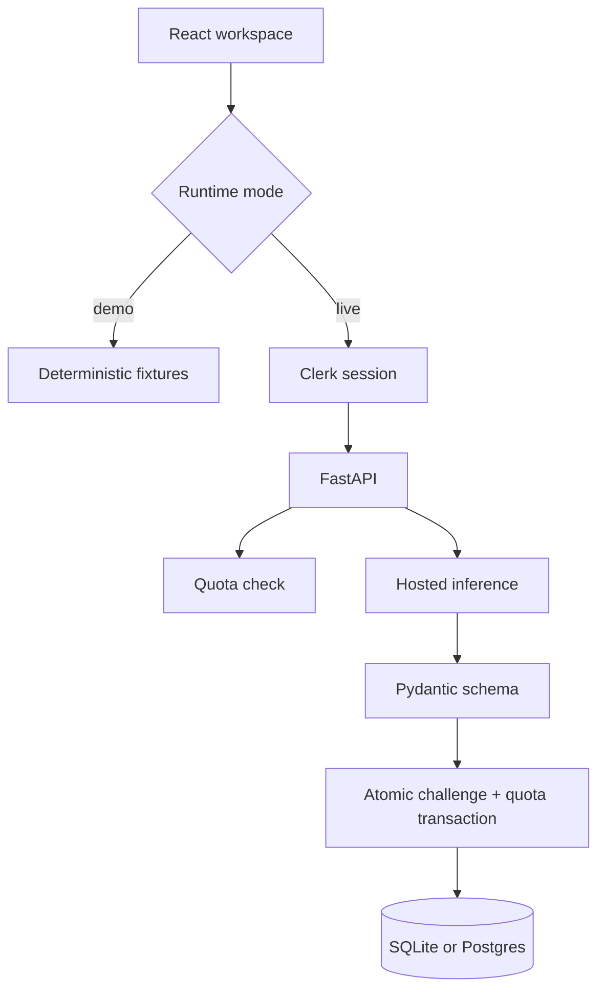

# Architecture

CodePrep has two frontend execution modes and one production API contract.

## Runtime Modes

### Demo

The default Vite build uses `DemoApiProvider`. It adds a short, intentional delay and serves deterministic challenges through the same `makeRequest()` interface used by production. This gives reviewers an honest, fully interactive product walkthrough without pretending that a hosted model or authentication service is available.

### Live

`VITE_CODEPREP_MODE=live` lazy-loads Clerk and `LiveApiProvider`. This keeps auth code out of the public demo bundle while preserving the complete signed-in flow.

## Generation Contract

The provider must return:

- A 10-500 character prompt.
- Exactly four unique, non-empty answer options.
- A correct answer index from `0` to `3`.
- A 20-2,000 character explanation.

`GeneratedChallenge` validates this contract. Malformed or empty provider responses become a generic `503`; they are not stored and do not decrement quota.

## Trust Boundaries

- Model and Clerk secrets stay in backend environment variables.
- CORS accepts configured origins, `GET`/`POST`, and only required headers.
- Clerk webhooks are signature-verified before user data is read.
- Auth failures and provider exceptions return generic public messages.
- History responses are ordered newest-first and limited to 100 records.

## Persistence

SQLite is the zero-configuration local default. `DATABASE_URL` can point SQLAlchemy at a hosted relational database. Production deployment should add migrations and managed Postgres before horizontal scaling.

## Source Map

- `backend/src/ai_generator.py`: hosted inference and output validation.
- `backend/src/routes/challenge.py`: auth, quota, generation, and transaction orchestration.
- `backend/src/routes/webhooks.py`: signed Clerk provisioning events.
- `backend/src/database/`: persistence models and helpers.
- `frontend/src/utils/`: demo/live implementations of one request contract.
- `frontend/src/challenge/`: generation, selection, and explanation states.
